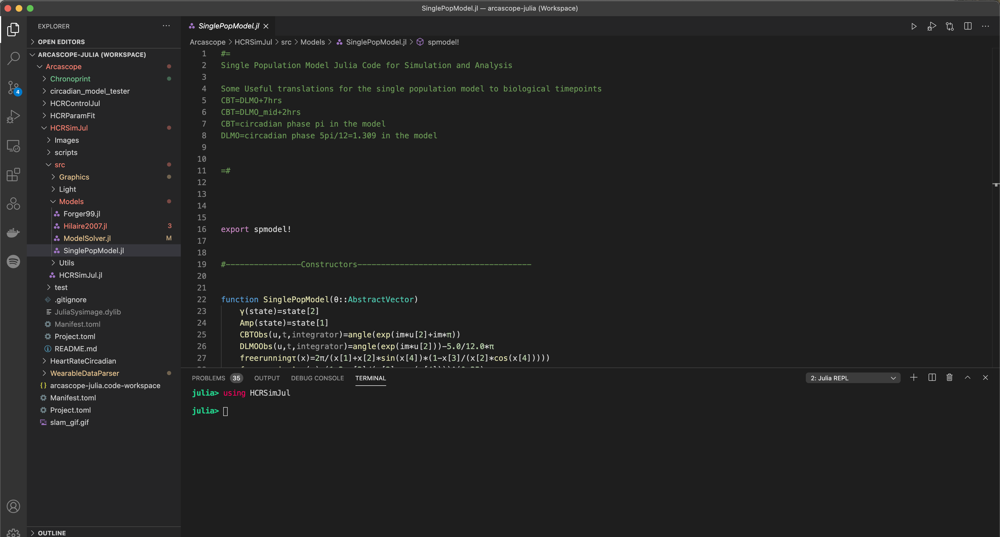
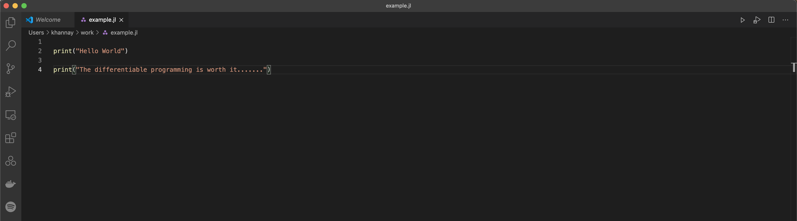
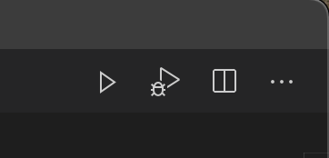
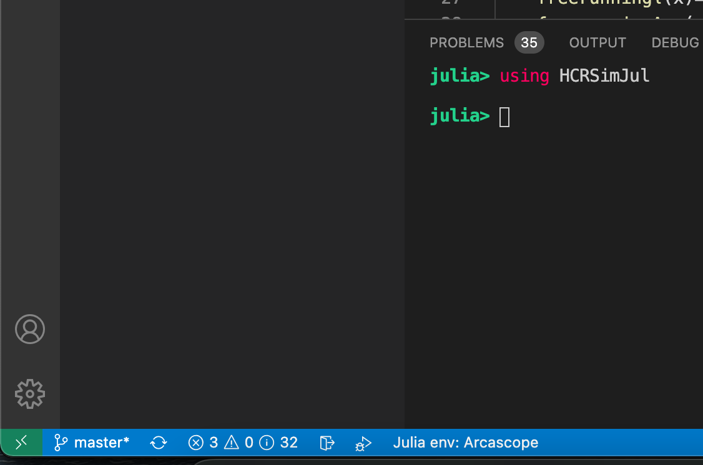
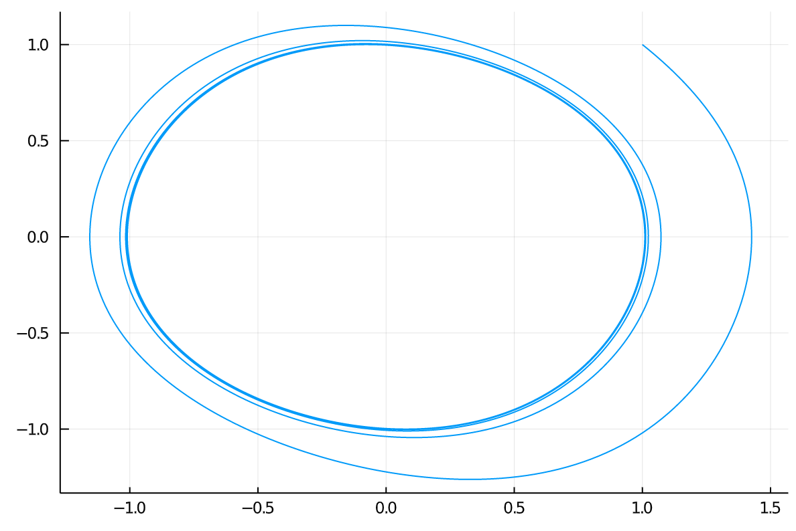
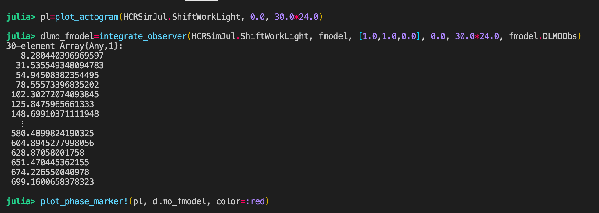
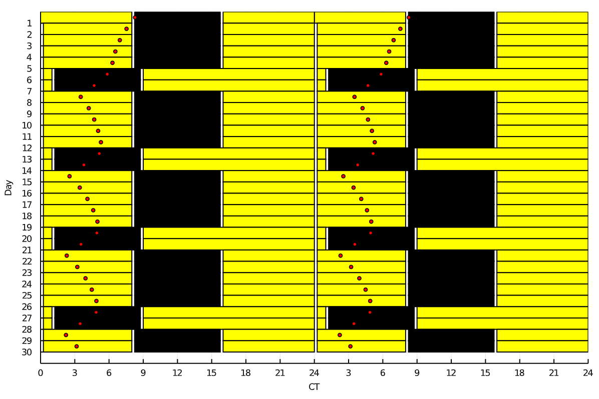

# :no_entry: [DEPRECATED] Active at [circadian](https://github.com/Arcascope/circadian)

## HCRSimJul

Human Circadian Rhythms Simulations in Julia

# Getting started with Julia

## Things to install

Here is a [guide](https://www.julia-vscode.org/docs/dev/gettingstarted/)

* Download and install Julia (at least version 1.5)
* Download and install visual studio code (vscode) and then install the julia language features
* Inside vs code you can launch a REPL (matlab like command prompt) by hitting Option+J+O. Also, you can start this REPL with the Julia: Start REPL command.

The REPL is a lot like an ipython terminal. 

## VS Code



This shows a screen shot of my julia development environment in vscode. The REPL is shown at the bottom of the screen. (OPTION+J+O)

To start you can open a new julia file and write a quick script.

**Give it the extension .jl to let vs code know it is a julia file** 



In the top right corner you see the run and debug buttons. 



You can run your script by hitting the triangle one. The debug button doesn't work very well......so I rarely use that for now. 

## Revise and startup.jl

Okay to do any serious programming in julia we need to add a few packages and have them load whenever we open a REPL. 

To do this we want to edit our **startup.jl** file for the julia version we have. This is like a bashrc file for Julia is you are a linux person. For me this file is found in 

```
/Users/khannay/.julia/config/startup.jl
```

The below lines load two packages which are super-useful and if they aren't available then it installs them....

```julia
# Setup OhMyREPL, Revise, Plots
import Pkg
let
    pkgs = ["Revise", "OhMyREPL"]
    for pkg in pkgs
    if Base.find_package(pkg) === nothing
        Pkg.add(pkg)
    end
    end
end

using Revise
using OhMyREPL
```

Save those changes and now those packages will load whenever we open a REPL. The OhMyREPL will add some color to the prompts and the [Revise package](https://timholy.github.io/Revise.jl/stable/config/) allows us to edit files and have them automatically reloaded into the REPL whenever we makes changes. That was we avoid having to load them a million times. 

## Package Management and Environments

Very quickly you will need to start using packages to get any use out of Julia....

Typically you will load packages using the command `using`

```julia
using Plots


plot(1:10, 1:10, color=:red)
```

If you try this you will likely get the error that Plots cannot be found. We need to add it.....

**Also you might be warned that loading plots can take 1-2 minutes, especially the first time.......that is one of the features of julia. Plenty of time to check your email. Really this is a side effect of the complied multiple dispatch core of Julia that is one of its big draws**

From the REPL you can can enter the package mode by typing `]`. This will show you the environment `(enviroment_name) pkg>` if you want to activate the environment defined in the current directory. 

```
pkg> activate . 
```

This will *activate* the environment. You can look at the packages being used in the current environment `pkg> status` and you can install those packages using the command `pkg> instantiate`. 

Within VScode you can see the current environment on the bottom right of the screen....



In this screenshot you can see I am in the Arcascope environment I have defined for myself. You can click this to change the package environment. 

Julia uses github to manage its packages. To add a package to the environment you should enter the package environment in the REPL with `]` and then type `add Plots` for example to add the Plots package to your environment. 

For public and official packages (like Plots) for Julia that is all you need to do. For official packages you can use the short name i.e `pkg> add DifferentialEquations`. For github private packages (or local packages even) you can add them to the environment using the add command and the github link for the repo. 

**You can also add a local package to the environment with `]` add /local/path**

If you want to add a different branch then master/main just use the # after you add the path to github. However, the add method has some serious drawbacks for packages you are currently developing. To see any changes to that package you would need to follow the workflow:

- Make changes to the package

- Push those changes to github 

- Within your environment do pkg> up PackageName to fetch the new versions

This is obviously a lot of work, so if you expect to be making a lot of changes to a package while in your current environment then you should use the command

```
>pkg dev path/to/package_locally
```

This means you can work on the package without having to push everything to github and go crazy in the process. 

You can *update* a package using the command *up packagename* this is important when you want to load a new version of one of your github packages. 

Julia has a pretty great package manager, you can create an environment within whatever directory you want. This is like the python environments and allows you to create a package environment. Generally, when you open a folder in vscode which has an environment inside it
it will activate the environment. (the package information is stored in the toml files Manifest.toml and Project.toml). 

## My Current Setup

I am developing a suite of Julia packages for Arcascope which have dependencies between one another and on external package suites. For example, the WearableDataParser package allows for us to read in wearable data from a collection of sources into a common format.

This data can then be used in this HCRSimJul package to make plots and run simulations. 

To develop all of these packages at the same time I have created a overall human circadian rhythms (HCR) workspace in VS code with each of the folders of the packages under development added. This way I can click around as much as I want between the packages all inside the same window. The right hand panel in vs code allows you to see the files and even manage git repos. 

To allow me to make changes and see them reflected I created an environment inside the super folder which contains the HCR packages....

From the REPL open to that directory....

```{julia}
pkg> activate . 

pkg> dev Package1(local path)
pkg> dev Package2(local path)
....
etc
```

Now we can develop and use all of these packages at the same time from this environment. 

# Using the HCRSimJul Package

In the REPL you will need to give the command:

```
using HCRSimJul
```

This will precompile the package and load it into the REPL. It will take some time....so be prepared to go get some coffee. 

The below code creates a model and integrates using a slam shift light schedule from initial conditions
[1.0,0.0,0.0] from 0.0 to 1000.0. 

```
model=SinglePopModel() 
sol=integrate_model(HCRSimJul.SlamShift, model, [1.0,0.0,0.0], 0.0, 1000.0)
```

We can also integrate using an observer to get DLMO/CBT times 

```
dlmo=integrate_observer(HCRSimJul.SlamShift, model, [1.0,0.0,0.0], 0.0, 1000.0, model.DLMOObs)
```

You can also use the Forger 99 model with the same functions

```julia
fmodel=Forger99()
sol=integrate_model(t -> 0.0, fmodel, [1.0,1.0,0.0], 0.0, 1000.0) 

plot(sol, vars=(1,2), label="")


```

The output of the integrate_model gives a solution type from the [DifferentialEquations ]([Ordinary Differential Equations · DifferentialEquations.jl](https://diffeq.sciml.ai/stable/tutorials/ode_example/)) library which is pretty great. 

For example, to get the solution at time 121.1 we can just use

```
sol(121.1)
```

This will automatically interpolate the numerical solution at that point. 





We can also make actogram plots and overlay DLMO predictions on them 



Gives the plot......




